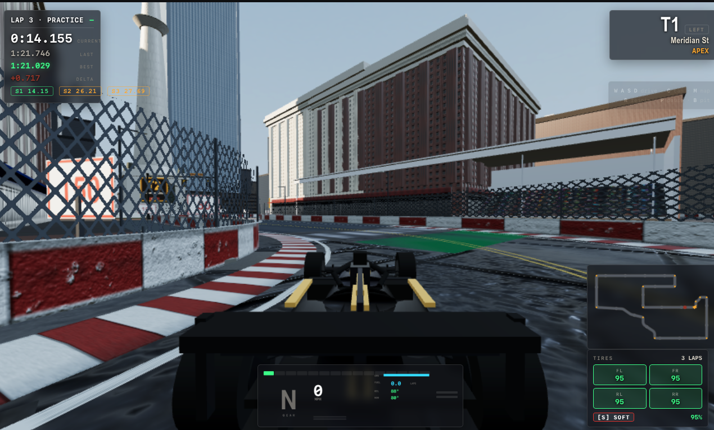

# Indianapolis Grand Prix

A Formula-style street circuit through downtown Indianapolis — the Mile Square,
real streets, 13 corners, racing against a 9-driver AI field. Browser-first,
built on TypeScript + Three.js.



## Play (dev)

Requires Node ≥ 20.11 and pnpm ≥ 9.

```bash
pnpm install
pnpm dev            # http://localhost:5173
```

Controls: `W/A/S/D` or arrows to drive · `Space` handbrake · `C` camera ·
`M` course map · `B` pit (drive through the marked entry) · `V` engine audio ·
`R` rejoin. A gamepad works too.

## Race modes

Pick from the main menu, or via URL param:

| Mode | Param | Format |
|---|---|---|
| Practice | `?race=practice` | Empty track, timing only — 3 sectors, live deltas vs your fastest lap |
| Sprint | `?race=sprint` | 15 laps |
| Half race | `?race=half` | 30 laps |
| Full race | `?race=full` | 61 laps |

Other params: `?difficulty=novice|pro|elite` · `?roster=random` ·
`?tyre=soft|medium|hard` · `?team=hogan|keystone|ironwood|novalis|stclair` ·
`?opponents=0..9`.

## What's in the sim

- **Race craft** — standing start, live classification, sector timing with
  F1-style pacing colors (green ahead / yellow behind / purple session-best),
  pit lane with strategy (tire health + fuel windows), tire compounds
  (soft/medium/hard) with measured-anchor wear, ERS, results podium.
- **AI field** — 9 named drivers with individual pace, tire care, aggression,
  and personas; pace derived from real player reference laps (no rubber-banding).
- **The circuit** — downtown Indianapolis at street scale: Monument Circle,
  Artsgarden, Victory Field, the South Street district, a full pit lane.

## Architecture

pnpm workspace, four packages, strictly layered:

| Package | Role |
|---|---|
| `packages/core` | Config, circuit data, physics, race/sector/pit-strategy logic. Zero dependencies, zero DOM — fully strict TypeScript. |
| `packages/render` | Three.js world, vehicles, materials. |
| `packages/platform` | Input, WebAudio engine, HUD, minimap, course map. |
| `packages/app` | Fixed-timestep game loop, session state, menu. |

`core` is render-agnostic by design: the render layer is replaceable without
touching physics or race rules.

```bash
pnpm typecheck      # tsc -b
pnpm build          # production build
node racev3_check.mjs   # headless race + tire-wear verification suite
```

## Status

Public beta — see [ROADMAP.md](ROADMAP.md) for the full plan: 1.0 (Q4 2026),
open demo (Q1 2027), photorealistic engine beta (Q3 2027).

## Credits

- Engine audio loop derived from the Ferrari F60 warmup recording
  ([Wikimedia Commons, cand_2.ogg](https://commons.wikimedia.org/wiki/File:Ferrari_F60_warm_up.ogg))
  by [cand](https://commons.wikimedia.org/wiki/User:Cand), **CC BY-SA 3.0** —
  cut to a seamless loop; derivative used under the same license.
- Built with [Three.js](https://threejs.org) (MIT) and [Vite](https://vitejs.dev) (MIT).

## License

[MIT](LICENSE)
